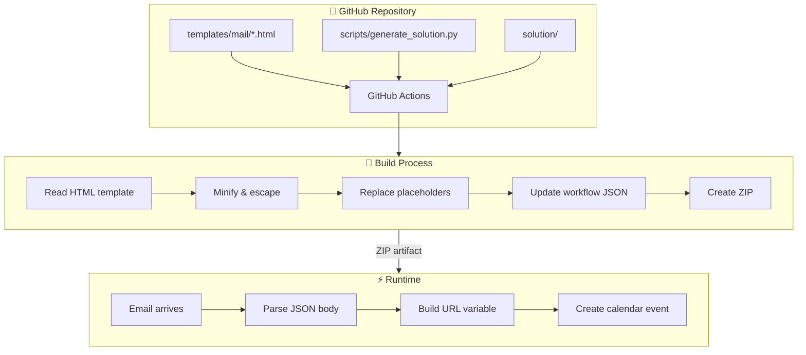

# 🏗️ Architecture

Technical documentation for developers and contributors who want to understand how the MS Outlook Auto-Invite solution works under the hood.

## 🔭 System Overview



## 📁 Repository Structure

```
ms-outlook-invite/
├── .github/workflows/       # GitHub Actions workflow definitions
│   ├── build-solution.yml   # Manual build trigger
│   └── smart-build-solution.yml  # Automated builds
├── assets/images/           # Icons for documentation
├── docs/images/             # Template images (GitHub Pages hosted)
├── scripts/
│   └── generate_solution.py # Build script
├── solution/
│   ├── Workflows/           # Power Automate workflow JSON
│   ├── customizations.xml
│   └── solution.xml
├── templates/mail/          # HTML email templates
│   ├── bmw.html
│   ├── volvo.html
│   ├── fluvius.html
│   └── default.html
├── README.md
├── YOURTEMPLATE.md          # Guide for creating templates
├── TROUBLESHOOTING.md       # Common issues and solutions
└── ARCHITECTURE.md          # This file
```

## ⚡ Power Automate Workflow

### 🎯 Trigger
The flow triggers when a new email arrives in the `AUTO-INVITE` folder with `[AUTO-INVITE]` in the subject.

### ⚙️ Actions

1. **Parse JSON**
   - Reads the email body
   - Extracts fields: `subject`, `attendees`, `description`, `location`, `host`, `projectKey`, `issueId`, `issueKey`, `boardNames`, `boardIds`, `boardName`

2. **Initialize Variables**
   - `boardURL` - Will hold the constructed Jira backlog URL
   - `foundBoardId` - Used for Enterprise-managed spaces
   - `index` - Loop counter for board matching

3. **Build Board URL**
   - **Team-managed spaces**: Single board, simple URL construction
   - **Enterprise-managed spaces**: Multiple boards, matches `boardName` against `boardNames` array to find correct `boardId`

4. **Create Event**
   - Creates Outlook calendar event
   - Injects the HTML template with dynamic values
   - Sets start time to `now()`, end time to `now() + 1 hour`

### 🔗 URL Construction Logic

**Team-managed**:
```
{host}/jira/software/projects/{projectKey}/boards/{boardIds}/backlog?epics=visible&issueParent={issueId}&selectedIssue={issueKey}
```
**Enterprise-managed**: (`foundBoardId` → built in PA flow from the other JSON parameters `boardNames`, `boardIds`, `boardName`)
```
{host}/jira/software/c/projects/{projectKey}/boards/{foundBoardId}/backlog?epics=visible&issueParent={issueId}&selectedIssue={issueKey}
```

## 🐍 Build Script

### 📄 `generate_solution.py`

The Python script that processes HTML templates into Power Automate-ready solutions.

### 🔧 What it does

1. **Read template**: Loads HTML from `templates/mail/{brand}.html`
2. **Minify**: Removes newlines and extra whitespace
3. **Escape quotes**: Converts `'` to `''` for Power Automate concat expressions
4. **Replace placeholders**: Converts template variables to PA expressions

| Template | Power Automate Expression |
|----------|---------------------------|
| `{{ ATTENDEES }}` | `body('Parse_JSON')?['attendees']` |
| `{{ SUMMARY }}` | `body('Parse_JSON')?['subject']` |
| `{{ DESCRIPTION }}` | `body('Parse_JSON')?['description']` |
| `{{ URL }}` | `variables('boardURL')` |

5. **Wrap in concat**: Wraps entire HTML in `@{concat('...')}` expression
6. **Update workflow**: Writes the processed template into the workflow JSON

### 💻 Usage

```bash
python3 scripts/generate_solution.py <brand>
```

Example:
```bash
python3 scripts/generate_solution.py bmw
```

This reads `templates/mail/bmw.html` and updates `solution/Workflows/*.json`.

## 🚀 GitHub Actions

### 🔨 `build-solution.yml` (Manual)

Manually trigger a build for a specific brand.

**Inputs:**
- `brand`: Which template to build (bmw, volvo, fluvius, default)

**Steps:**
1. Checkout repository
2. Run `generate_solution.py` with specified brand
3. Create ZIP of solution folder
4. Upload as release artifact

### 🤖 `smart-build-solution.yml` (Automated)

Automatically builds affected templates when changes are pushed.

**Triggers:**
- Push to `main` branch
- Changes to `templates/mail/*.html`, `scripts/*.py`, or `solution/**`

**Logic:**
1. Detect which files changed
2. Build only affected templates
3. If core files changed (script, solution), rebuild all templates
4. Create/update releases with `latest-{brand}-build` tags

### 📦 Release Artifacts

Each build creates a ZIP file:
- `MSOutlookInvite_bmw.zip`
- `MSOutlookInvite_volvo.zip`
- `MSOutlookInvite_fluvius.zip`
- `MSOutlookInvite_default.zip`

These are Power Automate solution packages ready for import.

## 🗂️ Solution Package Structure

The ZIP file contains a Power Automate solution:

```
MSOutlookInvite_brand.zip
├── [Content_Types].xml
├── customizations.xml
├── solution.xml
└── Workflows/
    └── ms-outlook-invite-*.json   # The actual workflow definition
```

### 📋 Workflow JSON

The workflow JSON (`solution/Workflows/*.json`) contains:
- **Connection references**: Links to Office 365 connector
- **Trigger definition**: Email arrival trigger with folder ID
- **Action definitions**: Parse JSON, variables, conditions, create event
- **Template body**: The processed HTML template with PA expressions

### 🔑 Important IDs

The workflow contains hardcoded IDs that are specific to the original environment:
- **Folder ID**: Points to the AUTO-INVITE folder (must be reconfigured after import)
- **Calendar ID**: Points to the default calendar
- **Connection reference**: Links to the Office 365 connector

Users must configure these after importing the solution.

## ➕ Adding a New Template

See [YOURTEMPLATE.md](./YOURTEMPLATE.md) for detailed instructions.

Quick summary:
1. Create `templates/mail/yourbrand.html`
2. Include all four placeholders
3. Push to trigger automated build
4. Download ZIP from releases
