#  Power Automate Import

How to distribute and import Power Automate Solutions.

## 🧩 Core Concepts

```mermaid
flowchart TB
    subgraph SOLUTION ["📦 Solution (distributable)"]
        FLOW["⚡ Flow<br/>Triggers & Actions"]
        CONNREF["🔗 Connector Reference<br/>(placeholder, no credentials)"]
    end

    subgraph USER ["👤 Your Environment"]
        CONN["🔑 Your Connector<br/>(your credentials)"]
    end

    FLOW --> CONNREF
    CONNREF -.->|"import links to"| CONN

    style SOLUTION fill:#e8f4fd,stroke:#0078d4
    style USER fill:#f0fff0,stroke:#28a745
```

| Element | Description | Shareable? |
|---------|-------------|------------|
| **Flow** | The automation (triggers, actions) | Via Solution |
| **Connector** | Your credentials (e.g., Outlook 365) | Never share |
| **Solution** | Package with Flow + Connector *reference* | Yes |

When you import a Solution, you select *your* Connector — credentials stay yours.

## ⚠️ The GUID Problem

Every element (Flow, Solution) has a unique identifier (GUID). This causes issues:

| Scenario | Result |
|----------|--------|
| Same user imports same Solution twice | Overwrites existing (OK for dev) |
| Different user imports same Solution | **Duplicate key error** |

```mermaid
flowchart LR
    subgraph TENANT ["🏢 Tenant (Organization)"]
        ENV1["Environment A<br/>User 1's Solution<br/>GUID: abc-123"]
        ENV2["Environment A<br/>User 2 imports same<br/>GUID: abc-123"]
    end

    ENV1 -.->|"❌ Conflict!"| ENV2

    style ENV2 fill:#ffcccc,stroke:#cc0000
```

**Solution**: Generate fresh GUIDs per user — see [GitHub Workflows](#-github-actions-workflows) below.

##  Power Platform Catalog (Premium)

For **Premium licenses**, Microsoft offers the Power Platform Catalog — an organization-wide store that automatically generates fresh GUIDs per user. The Solutions from our [Releases page](../../releases) can be imported there.

> **Note**: Not tested yet. For non-Premium users (Office 365 Standard), use the GitHub workflows below.

##  GitHub Actions Workflows

Three workflows populate the [Releases page](../../releases):

```mermaid
flowchart TD
    subgraph WORKFLOWS ["🔧 GitHub Workflows"]
        SMART["🤖 smart-build-solution<br/><i>Automatic on push</i>"]
        BUILD["🔨 build-solution<br/><i>Manual trigger</i>"]
        USER["👤 build-user-solution<br/><i>Manual trigger</i>"]
    end

    subgraph OUTPUT ["📦 Output"]
        STANDARD["Standard Solution<br/>Original GUIDs"]
        USERSOL["User-specific Solution<br/>Fresh GUIDs ✨"]
    end

    SMART --> STANDARD
    BUILD --> STANDARD
    USER --> USERSOL

    STANDARD -->|"Same user: OK<br/>Different user: ⚠️ may conflict"| PA1["Power Automate"]
    USERSOL -->|"Any user: OK ✅"| PA2["Power Automate"]

    style USER fill:#d4edda,stroke:#28a745
    style USERSOL fill:#d4edda,stroke:#28a745
```

| Workflow | Trigger | Fresh GUIDs? | Use case |
|----------|---------|--------------|----------|
| **smart-build-solution** | Auto (on push) | No | Catalog import, single user |
| **build-solution** | Manual (brand) | No | Rebuild specific brand |
| **build-user-solution** | Manual (brand + user) | **Yes** | Multi-user distribution |

**Naming convention**:
- Standard: `Latest <brand> Solution Build` (e.g., "Latest volvo Solution Build")
- User-specific: `Latest <brand> Solution Build (<user>)` (e.g., "Latest volvo Solution Build (test.user)") 

##  Importing

1. Go to [Power Automate](https://make.powerautomate.com)
2. Click **Solutions** → **Import solution**
3. Click **Browse** → Select your ZIP file → **Next**
4. Select your connection: **Office 365 Outlook** (not ".com"!) → **Import**
5. Wait for import to complete (status shows on top)
6. Open the solution and **turn on** the flow

📸 [Screenshots](https://johantre.github.io/ms-outlook-invite/pa.html)

---

## ⚠️ Re-importing User-Specific Solutions

When you import a **user-specific build** (with fresh GUIDs) again:

```mermaid
flowchart LR
    subgraph BEFORE ["Before re-import"]
        SOL1["📦 Solution v1"]
        FLOW1["⚡ Flow A<br/>GUID: old-123"]
    end

    subgraph AFTER ["After re-import"]
        SOL2["📦 Solution v1<br/><i>(overwritten)</i>"]
        FLOW1B["⚡ Flow A<br/>GUID: old-123<br/>⚠️ Still exists!"]
        FLOW2["⚡ Flow A<br/>GUID: new-456<br/>✨ New"]
    end

    SOL1 -->|"re-import"| SOL2
    FLOW1 -.->|"not deleted"| FLOW1B

    style FLOW1B fill:#fff3cd,stroke:#ffc107
    style FLOW2 fill:#d4edda,stroke:#28a745
```

**Result**: Two Flows with the same name → **two calendar invites** per trigger!

### 💡 Fix

After re-importing, go to **My Flows** and either:
- **Turn off** the old Flow
- **Delete** the old Flow (you can always rebuild) 
