# MS Outlook Auto-Invite ‚ûú‚ûú‚ûú

Automatically create Microsoft Outlook calendar invites from emails with JSON payloads. Perfect for integration with project management tools like Jira, Confluence, or any system that can send emails.

## 🎯 What Does This Do?

This project provides pre-built **Power Automate Solutions** that automatically:
1. Monitor a specific Outlook folder for emails with `[AUTO-INVITE]` in the subject
2. Parse JSON data from the email body
3. Create a calendar invite using a branded HTML template
4. Place the invite in your Outlook calendar

## 📊 Process Flow

```mermaid
%%{init: {'theme':'base', 'themeVariables': { 'primaryColor':'#f6f8fa','primaryTextColor':'#24292f','primaryBorderColor':'#d0d7de','lineColor':'#656d76','secondaryColor':'#f6f8fa','tertiaryColor':'#f6f8fa'}}}%%
graph LR
    JIRA["🎯 <b>Jira / Confluence</b><br/>Send email with<br/>JSON payload"]
    OUTLOOK["📧 <b>Outlook</b><br/>Email moved to<br/>AUTO-INVITE folder"]
    PA["⚡ <b>Power Automate</b><br/>Parse JSON<br/>Create invite"]
    MANUAL["👤 <b>You</b><br/>Review, find slot<br/>Send invite"]

    JIRA --> OUTLOOK --> PA --> MANUAL

    style JIRA fill:#f6f8fa,stroke:#d0d7de,stroke-width:2px,color:#24292f
    style OUTLOOK fill:#f6f8fa,stroke:#d0d7de,stroke-width:2px,color:#24292f
    style PA fill:#f6f8fa,stroke:#d0d7de,stroke-width:2px,color:#24292f
    style MANUAL fill:#f6f8fa,stroke:#d0d7de,stroke-width:2px,color:#24292f
```

## 🎨 Available Templates

Download from the [Releases page](../../releases):

| Template | File |
|----------|------|
| BMW | `MSOutlookInvite_bmw.zip` |
| Volvo | `MSOutlookInvite_volvo.zip` |
| Fluvius | `MSOutlookInvite_fluvius.zip` |
| Default | `MSOutlookInvite_default.zip` |

Want to create your own? See [YOURTEMPLATE.md](./YOURTEMPLATE.md).

## 📋 Prerequisites

- **Microsoft 365** account with Exchange mailbox and Power Automate access
- **Outlook** web or desktop client
- **Jira/Confluence** (or any system that can send emails)

## 🚀 Setup Guide

### Step 1: Download Your Template

1. Go to the [Releases page](../../releases)
2. Download the ZIP for your desired template
3. Save it somewhere accessible

### Step 2: Import into Power Automate

1. Go to [Power Automate](https://make.powerautomate.com)
2. Click **Solutions** → **Import solution**
3. Click **Browse** → Select your ZIP file → **Next** → Select your connection Office 365 Outlook, (**not** Office 365 Outlook **.com**!) → **Import**
4. Wait a little: importing status on top of page 
5. Open the solution and **turn on** the flow

📸 [Screenshots](https://johantre.github.io/ms-outlook-invite/pa.html)

### Step 3: Configure Outlook

**Create the folder:**
1. In Outlook, right-click your account → **Create new folder**
2. Name it: `AUTO-INVITE`

**Create the rule:**
1. Click **Settings** → **Mail** → **Rules** → **Add new rule**
2. Condition: Subject includes `[AUTO-INVITE]`
3. Action: Move to `AUTO-INVITE` folder

📸 [Screenshots](https://johantre.github.io/ms-outlook-invite/ol.html)

### Step 4: Configure Jira Automation

Create / import your Jira Automation rule by following [JIRA-AUTOMATION.md](./JIRA-AUTOMATION.md).

📸 [Screenshots](https://johantre.github.io/ms-outlook-invite/at.html) for Rule usage & creation example.

## 🖱️ Usage click paths

  <table>
    <tr><td><strong>Action</strong></td><td><strong>Screenshot</strong></td></tr>
    <tr>
      <td valign="top"> 1. Open an Epic → ⚡ Action button →  Click <strong>Create Meeting invite</strong> →  Fill out the <strong>board name</strong> for Company-managed board, OR Leave empty for Team-managed board.  
 Team-managed  
 Company-managed  
      </td>
      <td> 
Note: Screenshot in Jira shows "Create Meeting Invite" i.s.o. 
"AUTO-INVITE" on other screenshots.  
This is the name you gave your Jira automation (call it whatever you like). 
Note: The Jira import contains "Create Meeting Invite".
      </td>
    </tr>
    <tr>
      <td valign="top"> 2. Immediate mail in Outlook → Wait a little... → <strong>Invite is created</strong> (if this succeeded, the originated mail will be auto-deleted)</td>
      <td></td>
    </tr>
    <tr>
      <td valign="top"> 3. Double click invite to see details</td>
      <td></td>
    </tr>
    <tr>
      <td valign="top"> 4. Manual steps still required</td>
      <td>
        <ul>
          <li><strong>Review</strong> the invite details</li>
          <li><strong>Copy attendees</strong> from the invite body</li>
          <li><strong>Find a time slot</strong> that works for everyone</li>
          <li><strong>→ Why?</strong> The automation creates a <strong>placeholder</strong> invite for you to review. It doesn't auto-invite attendees,  giving you time to coordinate schedules and <strong>provide context and expectations to your attendees.</strong></li>
        </ul>
      </td>
    </tr>
    <tr>
      <td colspan="2" valign="top" style="background-color: #f0f0f0;"><strong>→ Why the manual steps?</strong> 
        The automation creates a <strong>placeholder</strong> invite for you to review.  It doesn't auto-invite attendees, giving you time to coordinate schedules and <strong>provide context and expectations</strong> to your attendees.
      </td>
    </tr>
  </table>

## 📚 Documentation

| Document                                   | Description                          |
|--------------------------------------------|--------------------------------------|
| [YOURTEMPLATE.md](./YOURTEMPLATE.md)       | Create your own branded template     |
| [JIRA-AUTOMATION.md](./JIRA-AUTOMATION.md) | Create / import your jira automation |
| [ARCHITECTURE.md](./ARCHITECTURE.md)       | Technical details for developers     |
| [TROUBLESHOOTING.md](./TROUBLESHOOTING.md) | Common issues and solutions          |

## 🙋 Support

- **Issues**: [GitHub Issues](../../issues)
- **Discussions**: [GitHub Discussions](../../discussions)

## 📜 License

This project is licensed under the Creative Commons Attribution-NonCommercial 4.0 International License (CC BY-NC 4.0). This means you can:

- Share: Copy and redistribute the material in any medium or format
- Adapt: Remix, transform, and build upon the material

Under the following terms:
- Attribution: You must give appropriate credit, provide a link to the license, and indicate if changes were made.
- NonCommercial: You may not use the material for commercial purposes.
- No additional restrictions: You may not apply legal terms or technological measures that legally restrict others from doing anything the license permits.

See the [LICENSE](LICENSE) file for details.

---

**Made with ❤️ for efficiency and automation**
