# MS Outlook Auto-Invite âœâœâœ

Automatically create Microsoft Outlook calendar invites from emails with JSON payloads. Perfect for integration with project management tools like Jira, Confluence, or any system that can send emails.

## 🎯 What Does This Do?

This project provides pre-built **Power Automate Solutions** that automatically:
1. Monitor a specific Outlook folder for emails with `[AUTO-INVITE]` in the subject
2. Parse JSON data from the email body
3. Create a calendar invite using a branded HTML template
4. Place the invite in your Outlook calendar

## 📊 Process Flow

```mermaid
%%{init: {'theme':'base', 'themeVariables': { 'primaryColor':'#f6f8fa','primaryTextColor':'#24292f','primaryBorderColor':'#d0d7de','lineColor':'#656d76','secondaryColor':'#f6f8fa','tertiaryColor':'#f6f8fa'}}}%%
graph LR
    JIRA["<b style='font-size:14px'><img src='assets/images/atlassian.png' width='25' height='25' /> Jira / Confluence / ...</b><br/><br/><div style='text-align:left;line-height:1.4'>• Send Email<br/>• Subject: [AUTO-INVITE]<br/>• Body: JSON payload</div>"]
    
    OUTLOOK["<b style='font-size:14px'>📧 Microsoft Outlook</b><br/><br/><div style='text-align:left;line-height:1.4'>• Email arrives in Inbox<br/>• Rule: move to<br/>&nbsp;&nbsp;-'AUTO-INVITE' folder</div>"]
    
    PA["<b style='font-size:14px'>⚡ Power Automate</b><br/><br/><div style='text-align:left;line-height:1.4'>• AUTO-INVITE folder<br/>• Parse JSON - extract data<br/>• Get fields<br/>&nbsp;&nbsp;- subject<br/>&nbsp;&nbsp;- description<br/>&nbsp;&nbsp;- attendees<br/>• Create HTML invite body<br/>&nbsp;&nbsp;- apply template<br/>• Create event<br/>&nbsp;&nbsp;- start: now<br/>&nbsp;&nbsp;- end: +1h</div>"]
    
    MANUAL["<b style='font-size:14px'>👤 Manual Actions Required</b><br/><br/><div style='text-align:left;line-height:1.4'>• Review invite in calendar<br/>• Copy/Paste attendees<br/>&nbsp;&nbsp;- from invite body<br/>• Find time slots<br/>&nbsp;&nbsp;- check calendars<br/>• Communicate attendees<br/>&nbsp;&nbsp;- scope<br/>&nbsp;&nbsp;- expectations<br/>• Send final invite</div>"]
    
    JIRA --> OUTLOOK --> PA --> MANUAL
    
    style JIRA fill:#f6f8fa,stroke:#d0d7de,stroke-width:2px,color:#24292f
    style OUTLOOK fill:#f6f8fa,stroke:#d0d7de,stroke-width:2px,color:#24292f
    style PA fill:#f6f8fa,stroke:#d0d7de,stroke-width:2px,color:#24292f
    style MANUAL fill:#f6f8fa,stroke:#d0d7de,stroke-width:2px,color:#24292f
```



## 🎨 Available Templates

Choose from pre-built branded templates on the [Releases page](../../releases):

- **BMW** - `MSOutlookInvite_bmw.zip`
- **Fluvius** - `MSOutlookInvite_fluvius.zip`
- **Volvo** - `MSOutlookInvite_volvo.zip`
- **Default** - `MSOutlookInvite_default.zip`

Each release is tagged as `latest-{brand}-build` for easy identification.

## 📋 Prerequisites

### Required Microsoft Licenses
To use this Power Automate Solution, you need one of the following:
- **Microsoft 365 Business Premium**
- **Microsoft 365 E3 or E5**
- **Power Automate per user plan**
- **Office 365 E3 or E5** (with Power Automate included)

### Required Permissions
- Access to Power Automate environment
- Outlook/Exchange Online mailbox
- Ability to create Outlook rules and folders

## 🚀 Setup Guide

### Step 1: Download Your Template

1. Go to the [Releases page](../../releases)
2. Download the ZIP file for your desired template (e.g., `MSOutlookInvite_bmw.zip`)
3. Save it to a location you can access

### Step 2: Import the Power Automate Solution

1. Navigate to [Power Automate](https://make.powerautomate.com)
2. Click **Solutions** in the left sidebar
3. Click **Import solution**
4. Click **Browse** and select your downloaded ZIP file
5. Click **Next**, then **Import**
6. Wait for the import to complete
7. Open the imported solution and **turn on** the flow

📸 *[Screenshots available on request]*

### Step 3: Configure Outlook

#### Create the AUTO-INVITE Folder

1. Open **Outlook** (web or desktop)
2. Right-click on your **Inbox**
3. Select **Create new subfolder**
4. Name it: `AUTO-INVITE`

#### Create an Outlook Rule

1. In Outlook, go to **Settings** > **Mail** > **Rules**
2. Click **Add new rule**
3. Configure the rule:
    - **Name**: Auto-Invite Mover
    - **Condition**: Subject includes `[AUTO-INVITE]`
    - **Action**: Move to folder `AUTO-INVITE`
4. Click **Save**

📸 *[Screenshots available on request]*

### Step 4: Configure Your Trigger System

Set up your external system (Jira, Confluence, custom app, etc.) to send emails with the following format:

#### Email Format

**Subject**: `[AUTO-INVITE] Your meeting title here`

**Body** (JSON):
```json
{
   "subject": "Sprint Planning Q1 2026",
   "description": "Discuss upcoming sprint goals and resource allocation",
   "attendees": "john.doe@company.com; jane.smith@company.com; team@company.com"
}
```

#### Example: Jira Automation

1. Go to **Project settings** > **Automation**
2. Create a new rule with trigger: **Issue transitioned**
3. Add action: **Send email**
4. Configure email:
    - **To**: Your email address
    - **Subject**: `[AUTO-INVITE] {{issue.summary}}`
    - **Body**:
   ```json
   {
     "subject": "{{issue.summary}}",
     "description": "{{issue.description}}",
     "attendees": "{{issue.customfield_10001}}"
   }
   ```

📸 *[Screenshots available on request]*

## 📝 JSON Payload Specification

The email body must contain valid JSON with the following fields:

| Field | Type | Required | Description |
|-------|------|----------|-------------|
| `subject` | String | Yes | Meeting title |
| `description` | String | Yes | Meeting description/agenda |
| `attendees` | String | Yes | Semicolon-separated email addresses |

**Notes:**
- Start time is automatically set to **now()** (current time)
- End time is automatically set to **1 hour after start**
- Attendees are included in the invite body but **not** as actual invitees (see Manual Steps)

## ⚠️ Important: Manual Steps Required

After the automation creates the calendar invite, you must:

1. **Copy the attendees list** from the invite body
2. **Find a common time slot** in all attendees' calendars
3. **Create a new meeting request** with:
    - The agreed-upon time slot
    - The copied attendees list
    - Meeting scope and expectations
    - Clear agenda and objectives

### Why Attendees Are Not Auto-Invited

The automation intentionally **does not** send calendar invites to attendees automatically. This gives you time to:
- Review the meeting details
- Find suitable time slots for all participants
- Add context and expectations
- Avoid premature calendar notifications

## 🛠️ How It Works

### Workflow Components

1. **Trigger**: New email in AUTO-INVITE folder with `[AUTO-INVITE]` in subject
2. **Parse JSON**: Extracts `subject`, `description`, and `attendees` from email body
3. **Generate HTML**: Injects data into the branded HTML template
4. **Create Event**: Creates Outlook calendar event with formatted body

### Python Build Script

The `generate_solution.py` script:
- Reads HTML templates from `templates/mail/{brand}.html`
- Minifies and escapes the HTML
- Replaces Jinja placeholders with Power Automate expressions
- Updates the workflow JSON with the processed template
- Outputs a ready-to-import solution

### GitHub Actions Workflows

#### `build-solution.yml` (Manual)
- Manually trigger builds for a specific brand
- Useful for testing or one-off builds

#### `smart-build-solution.yml` (Automated)
- Automatically detects changes to templates, scripts, or solution files
- Builds only affected brands
- Runs on every push to `main`
- Can be manually triggered to rebuild all brands

## 🎨 Creating Your Own Template

Want to create a custom branded template or contribute to the project?

👉 See [CONTRIBUTING.md](./CONTRIBUTING.md) for detailed instructions on:
- Creating custom HTML templates
- Adding your own brand
- Testing and building solutions
- Submitting pull requests

## 🤝 Use Cases

### Perfect For:
- **Jira Integration**: Auto-create meeting placeholders from tickets
- **Confluence**: Meeting requests from page updates
- **Custom Apps**: Any system that can send emails
- **Incident Management**: Rapid meeting creation for incidents
- **Project Management**: Automated sprint planning invites

### Real-World Example

**Problem**: Creating meetings from Jira tickets requires:
- Copy-pasting ticket details
- Manually typing attendees from a multi-person picker
- Switching between Jira and Outlook multiple times
- Risk of forgetting important details or people

**Solution**:
1. Jira automation sends formatted email on ticket transition
2. Power Automate creates calendar placeholder instantly
3. You review, find time slot, and send actual invite
4. Time saved: **5-10 minutes per meeting**

## 🔧 Troubleshooting

### Flow Not Triggering
- Verify the email subject contains `[AUTO-INVITE]`
- Check that the email reached the AUTO-INVITE folder
- Ensure the flow is **turned on** in Power Automate
- Check flow run history for error messages

### Invalid JSON Error
- Validate your JSON using [jsonlint.com](https://jsonlint.com)
- Ensure no line breaks in the email body
- Check for missing commas or quotes

### Calendar Event Not Created
- Verify your Outlook connection in Power Automate
- Check that you have calendar permissions
- Review flow run history for detailed error messages

### Attendees Not Formatted Correctly
- Use semicolons (`;`) to separate email addresses
- Ensure email addresses are valid
- No spaces before/after semicolons

## 📁 Project Structure

```
.
├── .github/workflows/       # CI/CD automation
│   ├── build-solution.yml   # Manual build workflow
│   └── smart-build-solution.yml  # Automated build workflow
├── docs/images/             # Brand logos
├── scripts/                 # Build scripts
│   └── generate_solution.py # Template injection script
├── solution/                # Base Power Automate solution
│   └── Workflows/           # Flow definition JSON
├── templates/mail/          # HTML email templates
│   ├── bmw.html
│   ├── fluvius.html
│   ├── volvo.html
│   └── default.html
└── shell/                   # Testing utilities
```

## 🐛 Known Limitations

- Requires manual time slot coordination
- Only supports Outlook/Exchange Online
- JSON must be in email body (attachments not supported)
- No support for recurring meetings
- Maximum 1-hour default meeting duration

## 📜 License

[Add your license here]

## 🙋 Support

- **Issues**: [GitHub Issues](../../issues)
- **Discussions**: [GitHub Discussions](../../discussions)
- **Screenshots**: Available on request for setup steps

## 🚀 Roadmap

- [ ] Support for recurring meetings
- [ ] Configurable meeting duration
- [ ] Teams meeting link generation
- [ ] Multi-language template support
- [ ] Attachment handling

---

**Made with ❤️ for efficiency and automation**