# MS Outlook Auto-Invite ‚ûú‚ûú‚ûú

Automatically create Microsoft Outlook calendar invites from emails with JSON payloads. Perfect for integration with project management tools like Jira, Confluence, or any system that can send emails.

## 🎯 What Does This Do?

This project provides pre-built **Power Automate Solutions** that automatically:
1. Monitor a specific Outlook folder for emails with `[AUTO-INVITE]` in the subject
2. Parse JSON data from the email body
3. Create a calendar invite using a branded HTML template
4. Place the invite in your Outlook calendar

## 📊 Process Flow

```mermaid
%%{init: {'theme':'base', 'themeVariables': { 'primaryColor':'#f6f8fa','primaryTextColor':'#24292f','primaryBorderColor':'#d0d7de','lineColor':'#656d76','secondaryColor':'#f6f8fa','tertiaryColor':'#f6f8fa'}}}%%
graph LR
    JIRA["<b style='font-size:14px'>🎯 Jira / Confluence / ...</b><br/><br/><div style='text-align:left;line-height:1.4'>• Send Email<br/>• Subject: [AUTO-INVITE]<br/>• Body: JSON payload</div>"]
    
    OUTLOOK["<b style='font-size:14px'>📧 Microsoft Outlook</b><br/><br/><div style='text-align:left;line-height:1.4'>• Email arrives in Inbox<br/>• Rule: move to<br/>&nbsp;&nbsp;-'AUTO-INVITE' folder</div>"]
    
    PA["<b style='font-size:14px'>⚡ Power Automate</b><br/><br/><div style='text-align:left;line-height:1.4'>• AUTO-INVITE folder<br/>• Parse JSON - extract data<br/>• Get fields<br/>&nbsp;&nbsp;- subject<br/>&nbsp;&nbsp;- description<br/>&nbsp;&nbsp;- attendees<br/>• Create HTML invite body<br/>&nbsp;&nbsp;- apply template<br/>• Create event<br/>&nbsp;&nbsp;- start: now<br/>&nbsp;&nbsp;- end: +1h</div>"]
    
    MANUAL["<b style='font-size:14px'>👤 Manual Actions Required</b><br/><br/><div style='text-align:left;line-height:1.4'>• Review invite in calendar<br/>• Copy/Paste attendees<br/>&nbsp;&nbsp;- from invite body<br/>• Find time slots<br/>&nbsp;&nbsp;- check calendars<br/>• Communicate attendees<br/>&nbsp;&nbsp;- scope<br/>&nbsp;&nbsp;- expectations<br/>• Send final invite</div>"]
    
    JIRA --> OUTLOOK --> PA --> MANUAL
    
    style JIRA fill:#f6f8fa,stroke:#d0d7de,stroke-width:2px,color:#24292f
    style OUTLOOK fill:#f6f8fa,stroke:#d0d7de,stroke-width:2px,color:#24292f
    style PA fill:#f6f8fa,stroke:#d0d7de,stroke-width:2px,color:#24292f
    style MANUAL fill:#f6f8fa,stroke:#d0d7de,stroke-width:2px,color:#24292f
```



## 🎨 Available Templates

At the moment of writing, you can choose from pre-built branded templates on the [Releases page](../../releases):

- **BMW** - `MSOutlookInvite_bmw.zip`
- **Fluvius** - `MSOutlookInvite_fluvius.zip`
- **Volvo** - `MSOutlookInvite_volvo.zip`
- **Default** - `MSOutlookInvite_default.zip`

Each release is tagged as `latest-{brand}-build` for easy identification.

## 📋 Prerequisites

### Required Microsoft Licenses
To use this Power Automate Solution, you need a MS account with:
- **Exchange enabled (having a mailbox)**
- **Power Automate permission**

Most corporate Licenses cover what's required, however. Following licenses meet the checklist.
- **Microsoft 365 Business Premium**
- **Microsoft 365 E3 or E5**
- **Office 365 E3 or E5** (with Power Automate included)
- **Power Automate per user plan**

### Required Permissions
- Access to Power Automate environment
- Outlook/Exchange Online mailbox
- Ability to create Outlook rules and folders

## 🚀 Setup Guide

###  Step 1: Download Your Template

1. Go to the [Releases page](../../releases)
2. Download the ZIP file for your desired template (e.g., `MSOutlookInvite_bmw.zip`)
3. Save it to a location you can access

###  Step 2: Import the Power Automate Solution

1. Navigate to [Power Automate](https://make.powerautomate.com)
2. Click **Solutions** in the left sidebar
3. Click **Import solution**
4. Click **Browse** and select your downloaded ZIP file
5. Click **Next**, select *your* connector then **Import**
6. Wait for the import to complete
7. Open the imported solution and **turn on** the flow

📸 Screenshots [click to view](https://johantre.github.io/ms-outlook-invite/pa.html)

###  Step 3: Configure Outlook

#### Create the AUTO-INVITE Folder

1. Open **Outlook** (web or desktop)
2. Right-click on **your account name** that contains Inbox, Drafts, Sent Items ... 
3. Select **Create new folder**
4. Name it: `AUTO-INVITE`

#### Create an Outlook Rule

1. In Outlook, go to **Settings** > **Mail** > **Rules**
2. Click **Add new rule**
3. Configure the rule:
    - **Name**: Auto-Invite Mover
    - **Condition**: Subject includes `[AUTO-INVITE]`
    - **Action**: Move to folder `AUTO-INVITE`
4. Click **Save**

📸 Screenshots [click to view](https://johantre.github.io/ms-outlook-invite/ol.html)

###  Step 4: Configure Your Trigger System

Set up your external system (Jira, Confluence, custom app, etc.) to send emails with the following format:

#### Email Format

**Subject**: `[AUTO-INVITE] Your meeting title here`

**Body** (JSON):
```json
  {
       "subject": "Sprint Planning Q1 2026",
       "attendees": "john.doe@company.com, jane.smith@company.com; team@company.com",
       "location": "Ball room",
       "description": "We need to get moving!",
       "host": "https://acme.atlassian.net",
       "projectKey": "MTM",
       "issueId": "1001",
       "projectKey": "MTM",
       "issueKey": "MTM-102",
       "boardNames": "My Board, His board",
       "boardIds": "34, 35",
       "boardName": "My Board"
  }

```

####  Example: Jira Automation

1. Go to **Project settings** > **Automation** or through the actions button (⚡) >  
2. Create a new rule with trigger: **Manually triggered**
3. Add action: **Send email**
4. Configure email:
    - **To**: Your email address
    - **Subject**: `[AUTO-INVITE] {{issue.summary}}`
    - **Body**:
   ```json
    {
        "subject": "{{issue.summary}}",
        "attendees": "{{issue.Involved People.emailAddress}}",
        "location": "Board room",
        "description": "{{issue.description.html.jsonEncode}}",
        "host": "{{baseUrl}}",
        "projectKey": "{{project.key}}",
        "issueId": "{{issue.id}}",
        "issueKey": "{{issue.key}}",
        "boardNames": "{{#webhookResponse.body.values}}{{name}}{{^last}}|||{{/}}{{/}}",
        "boardIds": "{{#webhookResponse.body.values}}{{id}}{{^last}}|||{{/}}{{/}}",
        "boardName": "{{userInputs.boardName}}"
    }
   ```
   (the ||| is to create a unique delimiter)    
#### JSON Payload Specification

The email body must contain valid JSON with the following fields:

| Field         | Type | Required   | Description                                                                              |
|---------------|------|------------|------------------------------------------------------------------------------------------|
| `subject`     | String | Yes        | Meeting title                                                                            |
| `attendees`   | String | Yes        | Semicolon-separated email addresses                                                      |
| `location`    | String | Yes        | Meeting start time                                                                       |
| `description` | String | Yes        | Meeting description/agenda                                                               |
| `host`        | String | Yes        | Host e.g. https://acme.atlassian.net/                                                    |
| `projectKey`  | String | Yes        | Project prefix of your issue: e.g. MTM                                                   |
| `issueId`     | String | Yes        | The id of your clicked issue: e.g. 10002                                                 |
| `issueKey`    | String | Yes        | The key of your clicked issue e.g. MTM-101                                               |
| `boardNames`  | String | Yes/No (*) | All the board names created for your Enterprise managed Space: e.g. My board, Your board |
| `boardIds`    | String | Yes        | All the board id's created for your Enterprise managed Space: e.g. 34, 35                |
| `boardName`   | String | Yes/No (*) | The board name you want to refer to in your URL (*)                                      |


**URL pointing the Jira Backlog view (*)**
- In Jira you have 2 types of Spaces (formerly called Projects), and have different URL signatures
  - Team-managed Spaces: Only 1 board Id
  - Enterprise-managed Spaces: Multiple boards possible, 'boardName' is key to retrieve the right board Id with index from found in boardNames 

📸 Screenshots [click to view](https://johantre.github.io/ms-outlook-invite/at.html)

## ⚠️ Important: Manual Steps Required

After the automation creates the calendar invite, you must:

1. **Copy the attendees list** from the invite body
2. **Find a common time slot** in all attendees' calendars
3. **Send your meeting invite** with:
    - The agreed-upon time slot
    - The copied attendees list
    - Meeting scope and expectations
    - Clear agenda and objectives

### Why Attendees Are Not Auto-Invited

The automation intentionally **does not** send calendar invites to attendees automatically. This gives you time to:
- Review the meeting details
- Find suitable time slots for all participants
- Add context and expectations to participants
- Avoid premature calendar notifications

##  How Power Automate Works

### Workflow Components

1. **Trigger**: New email in AUTO-INVITE folder with `[AUTO-INVITE]` in subject
2. **Parse JSON**: Extracts `subject`, `description`, and `attendees` from email body
3. **Generate HTML**: Injects data into the branded HTML template
4. **Create Event**: Creates Outlook calendar event with above formatted HTML body 

### Python Build Script

The `generate_solution.py` script:
- Reads HTML templates from `templates/mail/{brand}.html`
- Minifies and escapes the HTML
- Replaces Jinja placeholders with Power Automate expressions
- Updates the workflow JSON with the processed template
- Outputs a ready-to-import solution

### GitHub Actions Workflows

#### `build-solution.yml` (Manual)
- Manually trigger builds for a specific brand
- Useful for testing or one-off builds

#### `smart-build-solution.yml` (Automated)
- Automatically detects changes to templates, scripts, or solution files
- Builds only affected brands
- Runs on every push to `main`
- Can be manually triggered to rebuild all brands

## 🎨 Creating Your Own Template

<details>
Want to create a custom branded template or contribute to the project?

👉 See [CONTRIBUTING.md](./CONTRIBUTING.md) for detailed instructions on:
- Creating custom HTML templates (copy-paste an existing template)
- Adding your own brand text, image, style
- Testing and building solutions
- Submitting pull requests
</details>

## 🤝 Use Cases

<details>
### Perfect For:
- **Jira Integration**: Auto-create meeting placeholders from tickets
- **Confluence**: Meeting requests from page updates
- **Custom Apps**: Any system that can send emails
- **Incident Management**: Rapid meeting creation for incidents
- **Project Management**: Automated sprint planning invites

### Real-World Example

**Problem**: Creating meetings from Jira tickets requires:
- Copy-pasting ticket details
- Manually typing attendees from a multi-person picker
- Switching between Jira and Outlook multiple times
- Risk of forgetting important details or people

**Solution**:
1. Jira automation sends formatted email based on ticket details 
2. Power Automate creates calendar placeholder instantly
3. You review, find time slot, and send actual invite
4. Time saved: **5-10 minutes per meeting invite**
</details>

## 🔧 Troubleshooting

<details>

### Flow Not Triggering
- Verify the email subject contains `[AUTO-INVITE]`
- Check that the email reached the AUTO-INVITE folder
- Ensure the flow is **turned on** in Power Automate
- Check flow run history for error messages
- Each folder has an internal id. Renaming, removing the original `[AUTO-INVITE]` folder and re-creating a new `[AUTO-INVITE]` folder will result in automation fail, as in automation is referring to the old folder id. This id is to be found in [Workflow footprint](solution/Workflows/ms-outlook-invite-office365-flow-6659800E-7EF1-F011-8406-00224885F6FF.json) at the paths:   
  - triggers > action name > metadata > Id:
  - triggers > action name > inputs > parameters > folderPath:

### Invalid JSON Error
- Validate your JSON using [jsonlint.com](https://jsonlint.com)
- Ensure no line breaks in the email body
- Check for missing commas or quotes

### Calendar Event Not Created
- Verify your Outlook connection in Power Automate
- Check that you have calendar permissions
- Review flow run history for detailed error messages

### Attendees Not Formatted Correctly
- Use semicolons (`;`) to separate email addresses
- Ensure email addresses are valid
- No spaces before/after semicolons

### Testing & debugging 
#### Testing w/o external automation
- Sending mail manually to user to trigger Power Automate workflow
#### Logging
- Power Automate has logging at workflow level
- Atlassian automations have logging as well
#### Speed automation
- Atlassian automations are usually instant
- Receiving mail is usually instant
- Power Automate takes a few seconds, not 5 minutes

## ⛓️ Known Limitations

- Requires manual time slot coordination
- Power Automate only supports Outlook/Exchange
- JSON must be in email body (no html mail, attachments not supported)
- Maximum 1-hour default meeting duration
</details>

## 📜 License

[Add your license here]

## 🙋 Support

- **Issues**: [GitHub Issues](../../issues)
- **Discussions**: [GitHub Discussions](../../discussions)
- **Screenshots**: Available on request for setup steps

## 🚀 Roadmap

### Incoming JSON (Atlassian automation)
- [ ] Meeting duration is redundant (always 1h), JSON mail payload could be simpler
- [ ] JSON payload in mail could be enriched with URL of ticket
  - Moreover, dynamically get link with Backlog view (Backlog id in URL) of that ticket, <br>as it gives more context, e.g. all stories in Epic, work done, ...  

### Power Automate 
- [ ] Teams meeting iso Outlook invite: Teams link & also added to Outlook Calendar
- [ ] Differ color in Outlook Calendar based on Backlog id 

---

**Made with ❤️ for efficiency and automation**
