# 🎨 Create Your Own Template

This guide explains how to create your own branded HTML template for the MS Outlook Auto-Invite solution.

## 🧩 How It All Fits Together

Before diving in, understand that there are **two different JSONs** involved - don't confuse them!

```mermaid
flowchart LR
    subgraph BUILD ["🔧 BUILD TIME — GitHub Actions"]
        direction LR
        TPL["📄 <b>HTML Template</b><br/><code>templates/mail/brand.html</code><br/>─────────────<br/>{{ ATTENDEES }}<br/>{{ SUMMARY }}<br/>{{ DESCRIPTION }}<br/>{{ URL }}"]
        SCRIPT["🐍 <b>Python Script</b><br/><code>generate_solution.py</code><br/>─────────────<br/>Replaces {{ placeholders }}<br/>with PA expressions(*)"]
        SOL["📦 <b>Solution ZIP</b><br/><code>MSOutlookInvite_brand.zip</code><br/>─────────────<br/>Contains workflow JSON<br/>with PA expressions"]
        TPL --> SCRIPT --> SOL
    end

    subgraph RUNTIME ["⚡ RUNTIME — When email arrives"]
        direction LR
        JIRA["🔵 <b>Jira/Confluence</b><br/>─────────────<br/>Sends email with<br/>JSON in body"]
        EMAIL["📧 <b>Outlook Inbox</b><br/>─────────────<br/>Email moved to<br/>AUTO-INVITE folder"]
        PA["⚡ <b>Power Automate</b><br/>─────────────<br/>Parses JSON<br/>Uses PA expressions(*)<br/>Fills template<br/>Creates event"]
        CAL["📅 <b>Outlook Calendar</b><br/>─────────────<br/>Meeting invite<br/>with HTML body"]
        JIRA --> EMAIL --> PA --> CAL
    end

    SOL -.->|"import into PA environment"| PA
```



### 📋 The Two JSONs Explained

| JSON Type        | When | What                                                                                                                                  | Location |
|------------------|------|---------------------------------------------------------------------------------------------------------------------------------------|----------|
| **Input <br/>JSON**   | Runtime | Data payload with actual values like `"subject": "Sprint Planning Q1"`                                                                | Email body sent by Jira automation |
| **Solution JSON** | Build time | Workflow definition containing PA expressions like `body('Parse_JSON')?['subject']`<br> to get the data from the **Input JSON** above | `solution/Workflows/*.json` → packaged in ZIP |

**Your template only deals with placeholders** like `{{ SUMMARY }}`. The build script converts these to PA expressions, and Power Automate fills in the actual values at runtime.

## 🛤️ Choose Your Path

### 🤝 Option A: Contribute to this Repository

Add your template to the official repo so others can use it too.

1. Clone this repository
2. Create your template (see below)
3. Submit a Pull Request
4. Host your own images (optional, but recommended)
5. Enjoy the built Power Automate Solution 

Your template will be included in official releases and available to all users.\
As a bonus, this repo will provide all infrastructure for the built Power Automate (PA) Solutions you can download in the release section.\
The PA Solution can be imported in [your PA environment](https://make.powerautomate.com/).   

### 🍴 Option B: Fork for Independent Use

Create your own independent copy if you want full control.

1. Fork this repository
2. Create your template (see below)
3. Modify GitHub Actions if needed
4. Host your own images (mandatory)

## ✏️ Creating a Template

### 🚀 Quick Start: Copy an Existing Template (Recommended)

The easiest way to create a new template:

1. Copy an existing template from `templates/mail/`
2. Rename it to `yourname.html`
3. Modify the branding (colors, text, images)
4. Keep all `{{ VARIABLE }}` placeholders intact

### 🏗️ Starting from Scratch

If you prefer to build from scratch, your template must include:

#### 📌 Required Variables

Your HTML template **must** include these four placeholders exactly as shown:

| Placeholder | Description | Source |
|-------------|-------------|--------|
| `{{ ATTENDEES }}` | Email addresses of attendees | Jira field or manual input |
| `{{ SUMMARY }}` | Meeting title/subject | Issue summary |
| `{{ DESCRIPTION }}` | Meeting description (supports HTML) | Issue description |
| `{{ URL }}` | Link to relevant resource | Constructed from issue data |

#### 🏛️ Minimal Template Structure

```html
<!DOCTYPE html>
<html lang="en">
<head>
  <meta charset="UTF-8">
  <title>Meeting Invite</title>
</head>
<body>
  <!-- Your header/branding here -->

  <p>Attendees: {{ ATTENDEES }}</p>
  <p>Summary: {{ SUMMARY }}</p>
  <p>Description: {{ DESCRIPTION }}</p>
  <p><a href={{ URL }}>Link</a></p>

  <!-- Your footer here -->
</body>
</html>
```

> **Note**: The `href={{ URL }}` must be written without quotes around the placeholder. The build script handles the Power Automate expression syntax.

#### 💡 Email HTML Best Practices

Email clients have limited CSS support. Follow these guidelines:

- Use **inline styles** (no `<style>` blocks or external CSS)
- Use **tables for layout** (flexbox/grid not supported)
- Set explicit **widths** (650px is a safe maximum)
- Use **web-safe fonts** (Arial, Helvetica, Georgia, Times New Roman)
- Always include **bgcolor** attributes alongside background-color styles
- Test in multiple email clients (Outlook, Gmail, Apple Mail)

## 🖼️ Image Hosting

### 📂 Current Templates

The existing templates use GitHub Pages for image hosting:

```
https://johantre.github.io/ms-outlook-invite/images/bmw.png
```

These images are stored in `docs/images/` and served via GitHub Pages.

### 🎯 For Your Own Templates

You have several options:

#### 1️⃣ Option 1: No Images (Simplest)

See `templates/mail/default.html` for an example without background images. Uses solid colors and text-based headers instead.

#### 2️⃣ Option 2: Use This Repo's GitHub Pages (Contributors)

If contributing to this repo:

1. Add your image to `docs/images/`
2. Reference it as `https://johantre.github.io/ms-outlook-invite/images/yourimage.png`

#### 3️⃣ Option 3: Host Your Own Images

Mandatory for Forks, recommended for Enterprises in general, avoiding GitHub dependency.
For independent deployments, host images on your own infrastructure:

- Your own GitHub Pages (`https://yourusername.github.io/...`)
- Company CDN or web server
- Cloud storage (AWS S3, Azure Blob, etc.)

> **Important**: Email clients block images by default. Always provide a meaningful `bgcolor` fallback and don't rely solely on images for critical information.

## 📐 Template Sections Explained

Looking at the existing templates, here's the typical structure:

### 1️⃣ Header Row
Background image or solid color with meeting title.

### 2️⃣ Attendees Row
Displays the `{{ ATTENDEES }}` list in a highlighted box.

### 3️⃣ Introduction Row
Welcome text, expectations, and greeting. This is static text you can customize per brand/language.

### 4️⃣ Content Row
A table with three rows for:
- **Summary**: `{{ SUMMARY }}`
- **Description**: `{{ DESCRIPTION }}` (can contain rich HTML from Jira)
- **URL**: `{{ URL }}` link

Recommended layout uses `<colgroup>` for fixed label width:

```html
<table>
  <colgroup>
    <col style="width: 120px;">
    <col style="width: auto;">
  </colgroup>
  <tr>
    <td><h3>Summary</h3></td>
    <td>{{ SUMMARY }}</td>
  </tr>
  <tr>
    <td><h3>Description</h3></td>
    <td>{{ DESCRIPTION }}</td>
  </tr>
  <tr>
    <td><h3>URL</h3></td>
    <td><a href={{ URL }}>Link</a></td>
  </tr>
</table>
```

### 5️⃣ Footer Row
Company branding, contact information, and legal text.

## 🧪 Testing Your Template

### 💻 Local Testing

Recommended for tweaking your template. Some IDE's allow preview with localhost running in the background.
1. Open your HTML file in a browser to check basic rendering
2. The `{{ VARIABLES }}` will show as literal text - that's expected

### 🔨 Build Testing

If no IDE available with preview functionality, and static html viewing is needed:\
Run the build script locally to verify your template works:

```bash
python3 scripts/generate_solution.py yourtemplate
```

This replaces your template placeholders with Power Automate expressions and updates the workflow JSON. See [ARCHITECTURE.md](./ARCHITECTURE.md#-build-script) for full details on what the script does.

⚠️ **Important!** Running this locally will **OVERWRITE** the existing workflow JSON with a parsed version. Don't accidentally commit that change — it's not breaking, but unnecessary in your code base.

### 🔄 Full Integration Testing

1. Commit and push your changes
2. GitHub Actions will build the solution
3. Download the ZIP from Releases
4. Import into Power Automate
5. Trigger a test email by: 
   - triggering a Jira automation mailing for you
   - manually sending a mail. The body of your mail should NOT be HTML, but plain text
6. A mail will arrive in your mailbox 
   - with [AUTO-INVITE] in the subject 
   - JSON in the body 
   - and will be moved to AUTO-INVITE Outlook folder
7. Your imported PA automation will be triggered and create an invite in your Outlook Calendar.

📸 Screenshots [click to view](https://johantre.github.io/ms-outlook-invite/pa.html)

## ✅ Checklist Before Submitting

- [ ] Template renders correctly in browser
- [ ] All four placeholders (`{{ ATTENDEES }}`, `{{ SUMMARY }}`, `{{ DESCRIPTION }}`, `{{ URL }}`) are present
- [ ] No `<style>` blocks (inline styles only)
- [ ] Images have fallback background colors
- [ ] Template width is 650px or less
- [ ] Build script runs without errors
- [ ] Tested in actual email client (Outlook, Gmail, <your mail client>...)

## 📚 Examples

| Template | Description | Images |
|----------|-------------|--------|
| `default.html` | Minimal, no background images | No |
| `bmw.html` | BMW branding with header image | Yes |
| `volvo.html` | Volvo branding with header image | Yes |
| `fluvius.html` | Fluvius branding with header image | Yes |

Browse the `templates/mail/` directory for complete examples.
